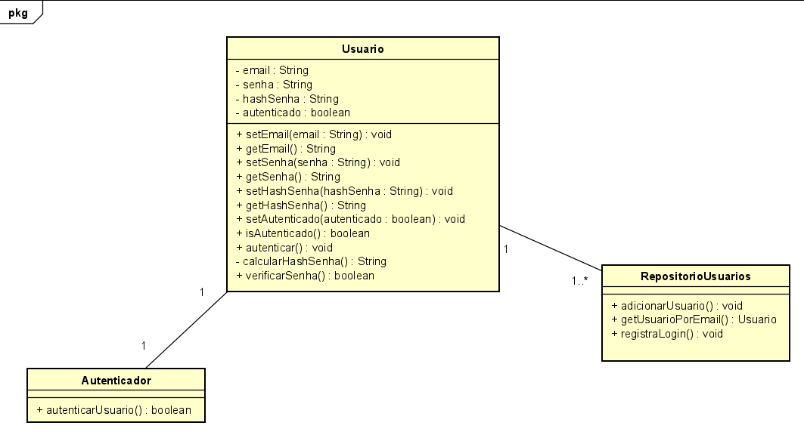

## Exercício 1

1. Este método é responsável por autenticar um usuário, verifica se o usuário existe, se as senhas coincidirem, atualiza o estado do usuário para autenticado, busca um usuário com um email e uma senha.

3. 

